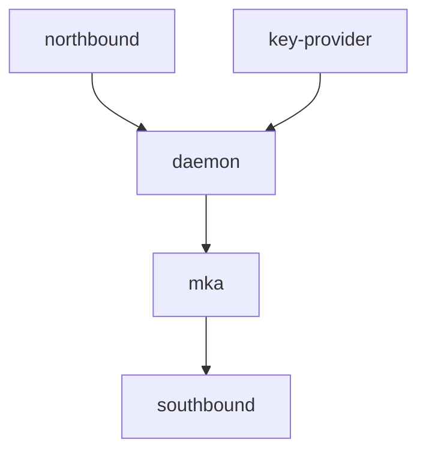

# Architecture

## Components

- **northbound** - CLI, configuration API, and runtime status queries
- **daemon** - Core orchestration and lifecycle management
- **mka** - MKA protocol implementation
- **southbound** - Kernel/driver interface for SA management
- **key-provider** - Key source abstraction (static config, HSM, etc.)

## Dependency Direction

All dependencies point downward. `key-provider` is invoked by `daemon`, which passes keys to `mka`.
